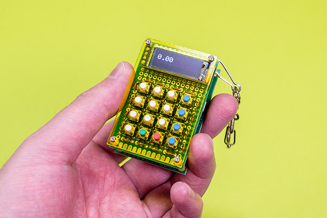
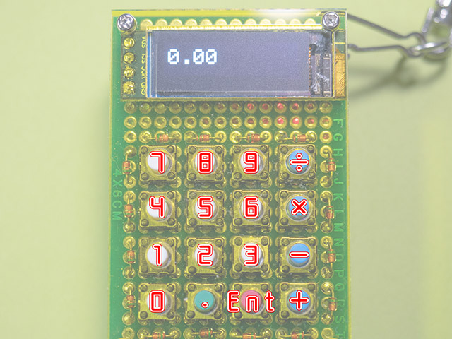
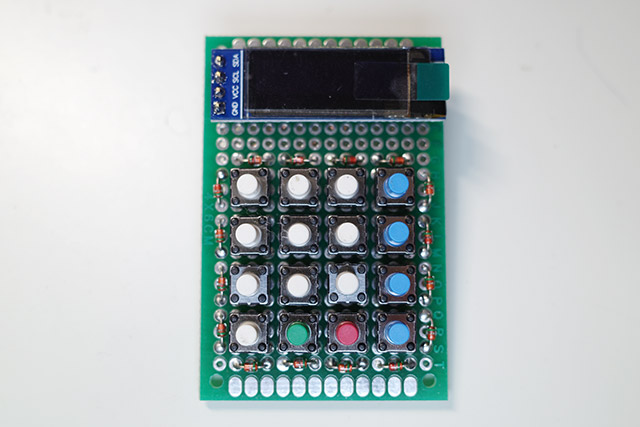
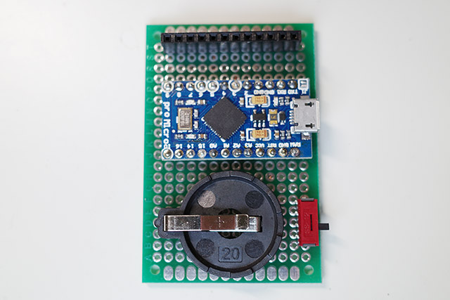
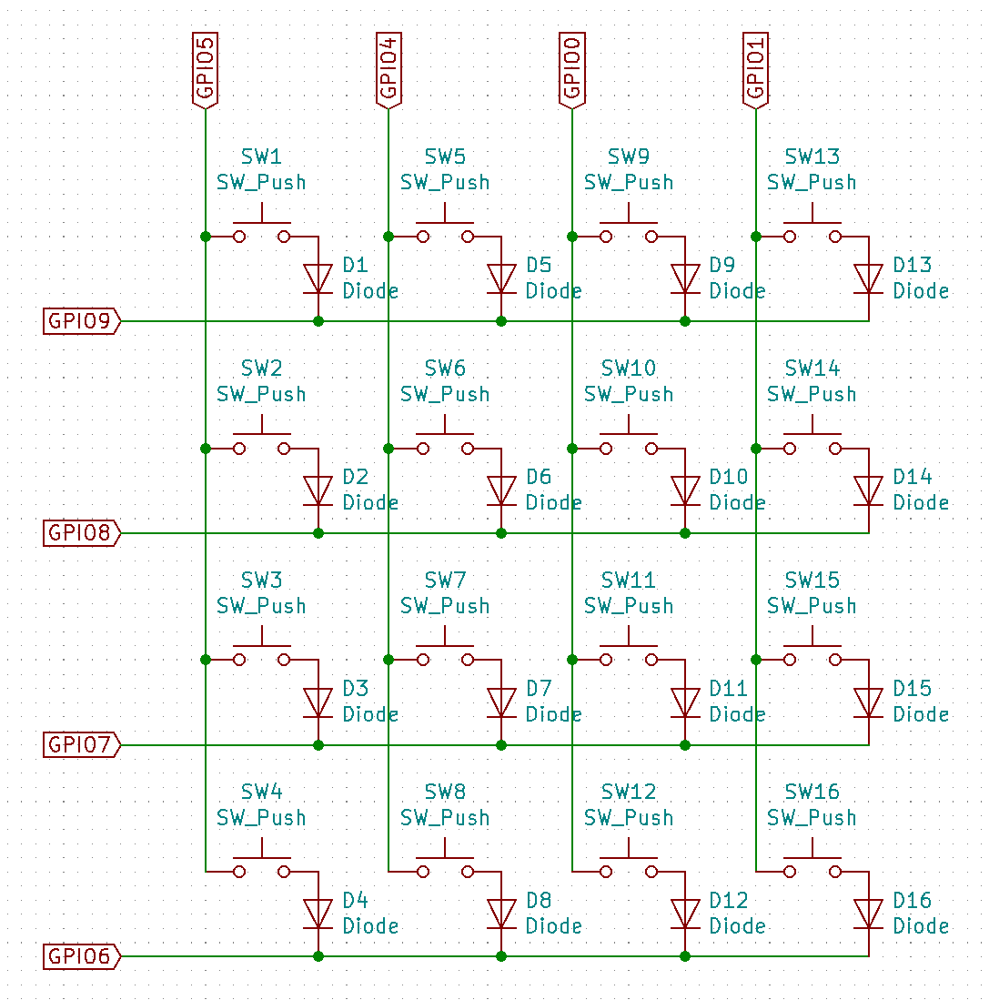

# simple_rpn_calc
Very simple code of RPN calculator for Arduino

## What's this?

I made a keychain type RPN calculator like a toy with Arduino.

The aim of this calculator is "anyone can use RPN". So the function is very simple.

- There are only 16 keys, numerals(0-9), operators(+-\*/), decimal point(.), and Enter.
- Integers can only display up to 7 digits.
- Decimals can only display up to 2 digits.
- Display is in fixed-point mode only. If it overflows, an error will occur.

As long as you know RPN, you can use it easily.

Please also see the following article (in Japanese).
https://dailyportalz.jp/kiji/RPN-calculator

## about Hardware

Required parts:
- Arduino compatible microcontroller (ex. ProMicro)
- 0.91 inch OLED display
- 16 push switches and diodes
- Power switch
- Battery holder

The key matrix circuit is assumed as follows.
To eliminate the resistor, this configuration utilizes the Arduino's internal pull-up resistor.

